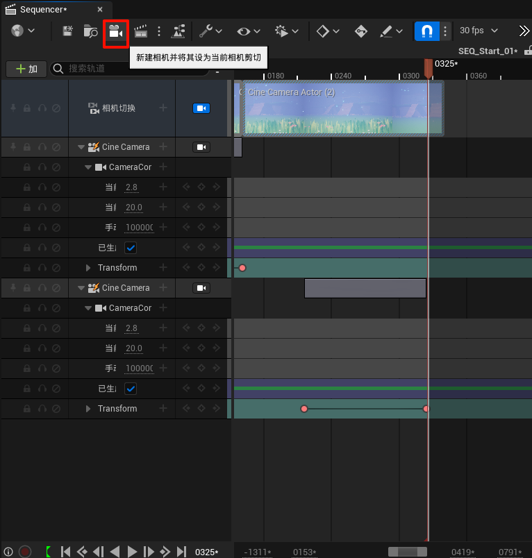
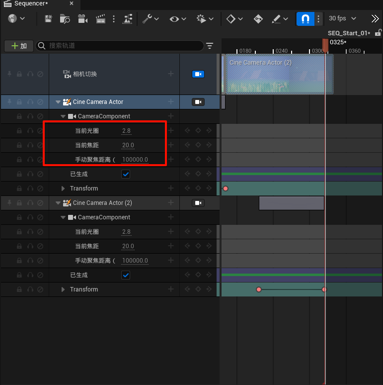
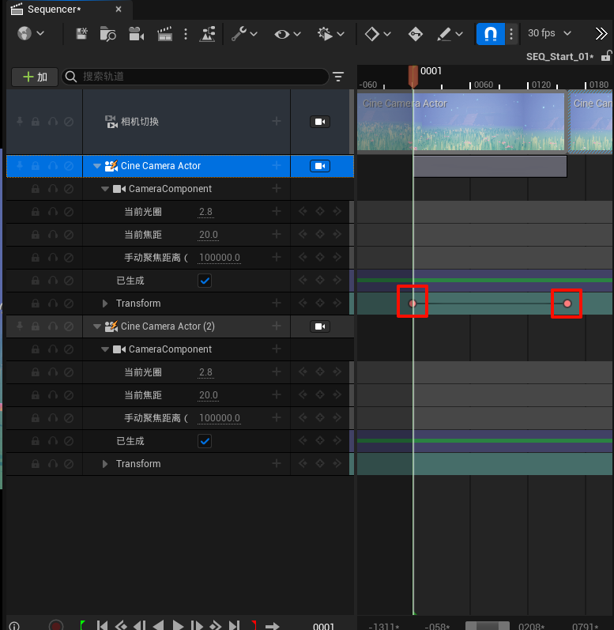

title: UE5_初涉过场动画
tags: [UE5引擎学习]
cover: /images/pic/UE5/UE5.png
categories: [UE5引擎学习]
date: 2024-12-30
description: UE5_初涉过场动画
articleGPT: UE5_初涉过场动画
references:

- title: 无
  url: 无

---

## 1. 点击添加「添加关卡序列」

## 2.点击添加新的相机

## 3.调试相机相关的参数，如「光圈」、「焦距」等

## 4.选择合适的镜头位置，按下「S」，打下关键帧

不同机位的设置按照上面的步骤从头配置一遍即可，需要注意的是**上一个机位的「结束关键帧」需要和下一个机位的「开始关键帧」对齐**
